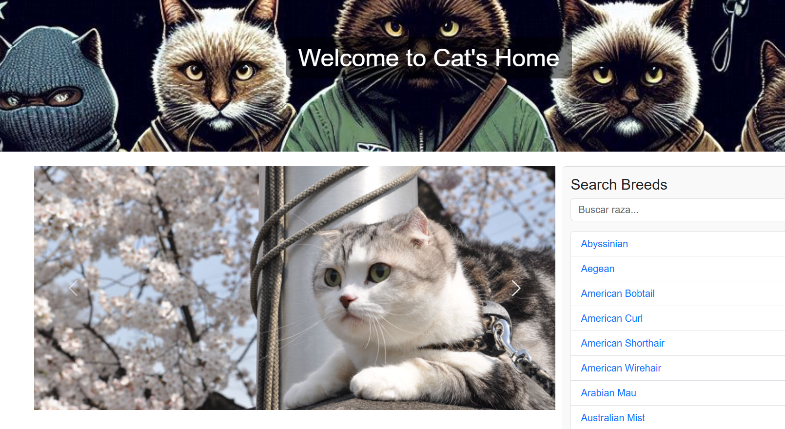
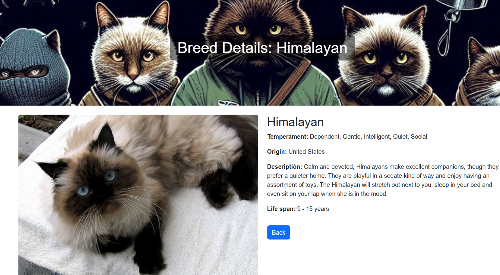

# **CatProject 🐱**

¡Bienvenido a **CatProject**! Esta es una aplicación web que permite buscar razas de gatos, ver detalles e imágenes aleatorias usando **The Cat API**. Además, incluye un sistema de favoritos para que los usuarios puedan guardar sus razas favoritas.

---

## **Características**
- 🎠 **Carrusel**: Muestra imágenes aleatorias de gatos.
- 🔍 **Buscador de Razas**: Filtra razas de gatos por nombre.
- 📄 **Detalles de Raza**: Muestra información detallada sobre cada raza, como su temperamento, origen y esperanza de vida.
- ❤️ **Favoritos**: Permite a los usuarios guardar sus razas favoritas.
- 🌐 **Despliegue en Render**: La aplicación está desplegada en [Render](https://render.com).

---

## **Tecnologías Utilizadas**
- **Backend**:
  - [Node.js](https://nodejs.org/): Entorno de ejecución para JavaScript del lado del servidor.
  - [Express.js](https://expressjs.com/): Framework para construir aplicaciones web y APIs.
  - [Axios](https://axios-http.com/): Cliente HTTP para consumir APIs externas.
  - [dotenv](https://github.com/motdotla/dotenv): Manejo de variables de entorno.

- **Frontend**:
  - [EJS](https://ejs.co/): Motor de plantillas para renderizar vistas dinámicas.
  - [Bootstrap](https://getbootstrap.com/): Framework CSS para diseño responsivo y atractivo.
  - HTML5, CSS3 y JavaScript.

- **API Externa**:
  - [The Cat API](https://thecatapi.com/): Proporciona imágenes e información sobre razas de gatos.

- **Despliegue**:
  - [Render](https://render.com/): Plataforma para alojar aplicaciones web dinámicas.

---

## **Capturas de Pantalla**
### Página Principal
Página Principal  


### Detalles de Raza
Detalles de Raza 



---

## **Instalación y Uso Localmente**

### 1. Clonar el Repositorio
```bash
git clone https://github.com/victor522m/catProject.git
cd catProject
```

### 2. Instalar Dependencias
Asegúrate de tener [Node.js](https://nodejs.org/) instalado. Luego ejecuta:
```bash
npm install
```

### 3. Configurar Variables de Entorno
Crea un archivo `.env` en la raíz del proyecto con las siguientes variables:
```
CAT_API_KEY=tu_clave_api_aquí
CAT_API_URL=https://api.thecatapi.com/v1
PORT=3000
```
Reemplaza `tu_clave_api_aquí` con tu clave API obtenida desde [The Cat API](https://thecatapi.com/).

### 4. Iniciar el Servidor
Ejecuta el siguiente comando:
```bash
npm start
```

La aplicación estará disponible en:  
`http://localhost:3000`

---

## **Despliegue**
La aplicación está desplegada en Render y accesible desde el siguiente enlace:  
🔗 [CatProject en Render](https://catproject-58nz.onrender.com)

---

## **Estructura del Proyecto**
```
catProject/
├── src/
│   ├── controllers/
│   │   └── catController.js      # Lógica del backend (controladores)
│   ├── models/
│   │   └── catModel.js           # Interacción con The Cat API
│   ├── routes/
│   │   └── catRoutes.js          # Definición de rutas principales
│   ├── views/
│   │   ├── index.ejs             # Página principal (EJS)
│   │   └── breedDetails.ejs      # Detalles de raza (EJS)
│   └── app.js                    # Configuración principal del servidor
├── public/
│   ├── css/
│   │   └── styles.css            # Estilos personalizados
│   ├── js/
│   │   └── main.js               # Lógica del frontend (favoritos, buscador)
├── .env                          # Variables de entorno (no se sube a GitHub)
├── .gitignore                    # Archivos/carpetas ignorados por Git
├── package.json                  # Dependencias y scripts del proyecto
└── README.md                     #

---
